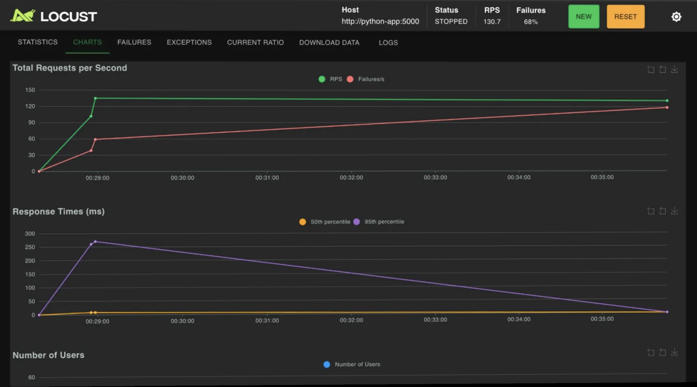
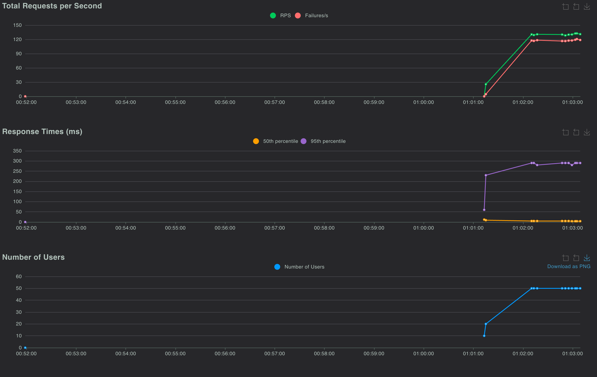
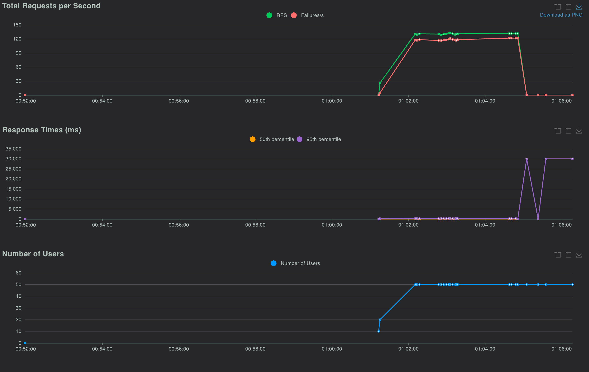
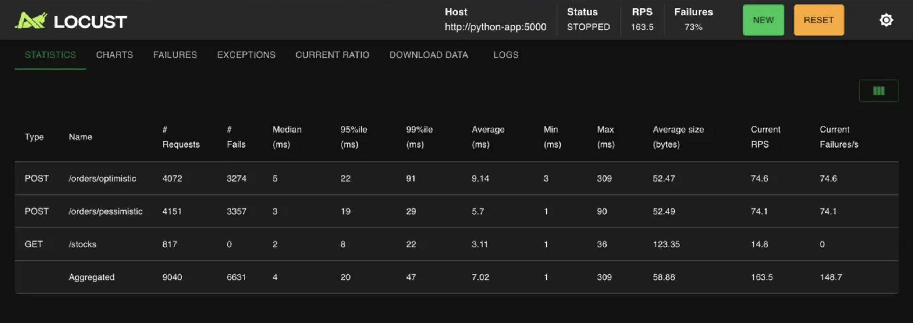
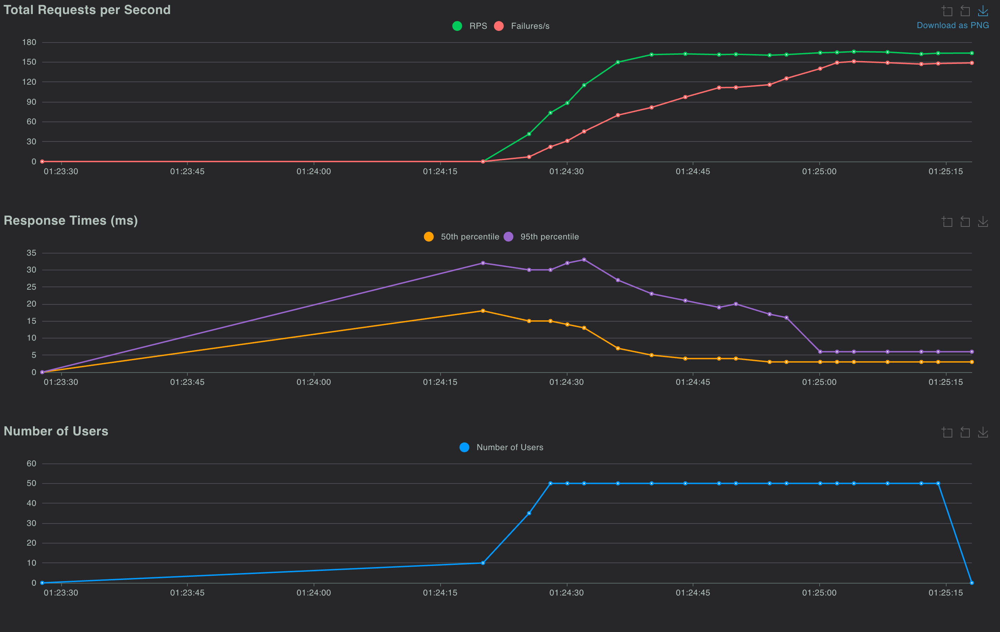

# Labo 09 – Bases de données distribuées et verrous distribués

ÉTS – LOG430 – Hassen Aissaoui – 2 avril 2026

---

**Question 1 : Quelle est la sortie du terminal que vous obtenez? Si vous répétez cette commande sur yugabyte2 et yugabyte3, est-ce que la sortie est identique?**

Après avoir exécuté le test de concurrence avec 5 threads sur le produit 3, on observe 4 nouvelles commandes dans la table orders. En exécutant la requête SELECT sur chacun des trois nœuds, la sortie est identique :

```
ysqlsh -h yugabyte1 -U yugabyte -c "SELECT * FROM orders;"
 id  | user_id | total_amount | payment_link | is_paid | created_at
-----+---------+--------------+--------------+---------+-------------------------------
   1 |       1 |         5.75 |              | f       | 2026-04-02 03:49:12.651328+00
 102 |       2 |         5.75 |              | f       | 2026-04-02 03:49:12.841122+00
 101 |       2 |         5.75 |              | f       | 2026-04-02 03:49:12.650515+00
 201 |       1 |         5.75 |              | f       | 2026-04-02 03:49:12.811672+00
(4 rows)
```

Les résultats sont identiques sur yugabyte2 et yugabyte3. Cela démontre que la réplication fonctionne correctement dans le cluster : les données écrites sur un nœud sont automatiquement accessibles depuis tous les autres nœuds.

---

**Question 2 : Observez la latence moyenne des deux approches avec 20 threads. Laquelle a la latence moyenne la plus élevée et pourquoi?**

Optimiste : 0.277s de latence. Pessimiste : 0.131s de latence.

Le taux de conflit augmente avec 20 threads qui tentent simultanément de modifier les deux unités de stock du produit 3. Cela est dû au fait qu'avec l'approche optimiste, on tente un UPDATE et si la version a changé entre-temps, on doit tout recommencer depuis le début. Ce nombre élevé de tentatives accumulent la latence. Avec l'approche pessimiste, dès la lecture, elle obtient un verrou exclusif. Cela fait que les autres threads sont simplement bloqués et échouent rapidement.

---

**Question 3 : Répétez le test avec 5 threads au lieu de 20. Quelle approche a actuellement la latence moyenne la plus élevée et pourquoi?**

L'approche optimiste a toujours la latence la plus élevée : 0.165s contre 0.049s pour le pessimiste. Même avec moins de threads, la latence reste forte puisqu'il n'y a que 2 unités de stock pour 5 threads. Les threads en échec pour optimiste font encore des retries coûteux (0.245s), alors que pour pessimiste, les échecs sont résolus très rapidement (0.051s). Mais, l'écart est réduit par rapport au test à 20 threads, car il y a moins de conflits en même temps. L'approche optimiste serait plus avantageuse dans un scénario où les conflits sont rares, par exemple avec un stock élevé et peu de threads accédant à la même ligne.

---

**Question 4 : En utilisant YugabyteDB, quelle stratégie de verrouillage affiche le plus bas taux d'erreurs et la plus basse latence moyenne?**

Le pessimiste a une latence beaucoup plus basse (4.78 ms vs 173.37 ms) parce que chaque requête est traitée rapidement, soit le verrou est acquis et la commande passe, soit elle échoue directement. L'optimiste, lui, fait des retries à chaque conflit de version, ce qui fait grimper la latence et réduit le débit (2745 requêtes traitées vs 4108). Par contre, l'optimiste a un taux d'erreur légèrement plus bas (73% vs 77%), car les retries lui donnent plus de chances de réussir à passer une commande.



---

**Question 5 : Est-ce que le taux d'erreur a augmenté lors de l'arrêt du nœud? Combien de temps a duré le basculement (approximativement)?**

Oui, le taux d'erreur a augmenté significativement lors de l'arrêt du nœud. Le basculement a duré environ 2-3 minutes, durant ces minutes, les requêtes échouaient ou avaient des latences très élevées (jusqu'à 150 secondes au 95e percentile). Après le redémarrage de yugabyte2, le cluster s'est restabilisé et a repris un fonctionnement normal, ce qui démontre la résilience du cluster, car le système a continué à fonctionner (même dégradé) et s'est rétabli automatiquement.





.png)

---

**Question 6 : En utilisant CockroachDB, quelle stratégie de verrouillage affiche le plus bas taux d'erreurs et la plus basse latence?**

Avec CockroachDB, la stratégie pessimiste affiche la latence la plus basse (5.7 ms vs 9.14 ms pour l'optimiste). Les deux stratégies ont un taux d'erreur très similaire (~80%). Contrairement à YugabyteDB, l'écart entre les deux stratégies est beaucoup plus faible (facteur de ~1.6x contre ~36x sur YugabyteDB). Le nombre de requêtes traitées est presque identique (4151 vs 4072), ce qui indique que CockroachDB gère les retries de l'approche optimiste de façon beaucoup plus efficace.





---

**Question 7 : Quelle base de données affiche le plus bas taux d'erreurs et la plus basse latence? Est-ce YugabyteDB ou CockroachDB?**

CockroachDB offre globalement de meilleures performances. Son débit est supérieur (163.5 RPS vs 130.7), sa latence agrégée est beaucoup plus basse (7.02 ms vs 65.77 ms), et surtout, sa latence pour la stratégie optimiste est 19 fois plus basse (9.14 ms vs 173.37 ms). La différence principale vient de la gestion des retries en mode optimiste. CockroachDB, qui utilise MultiRaft, résout les conflits de version de façon beaucoup plus efficace.

Par contre, YugabyteDB un taux d'erreur légèrement plus bas (68% vs 73%), et une latence pessimiste meilleure (4.78 ms vs 5.7 ms). En termes de performance globale sous forte concurrence, CockroachDB est le gagnant pour ce scénario de test.